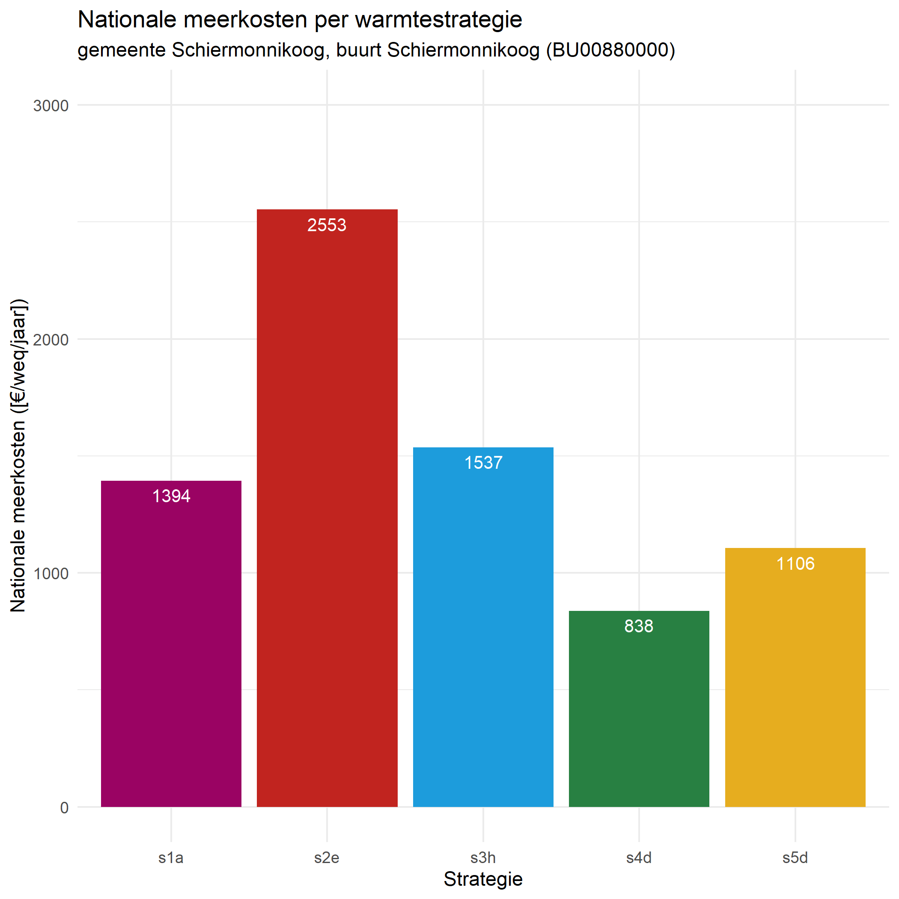

```{r setup, include=FALSE}
knitr::opts_chunk$set(echo = TRUE)
```

# startanalyse
 
Dit script maakt plots van de nationale kosten voor alle buurten in een gemeente, uitgesplitst per warmtestrategie uit de startanalyse

# startanalyse data

De gemeenterapportages van PBL worden als input gebruikt. Plaats .zip-bestanden van de [leidraad](https://themasites.pbl.nl/leidraad-warmte/2020/#) in de `input_data` map en voer het script plot meerkosten.R uit.

# Plots
De plots laten de nationale kosten (per WEQ) zien voor de vijf verschillende warmtestrategiën

```{r cars, include=FALSE}
bestanden <- list.files("plots/", full.names = TRUE, recursive = TRUE)
file.copy(bestanden[1], "voorbeeld.png", overwrite = TRUE)
```

